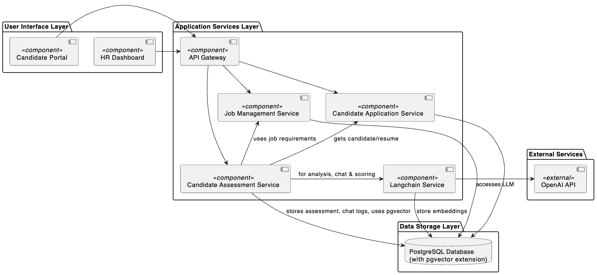
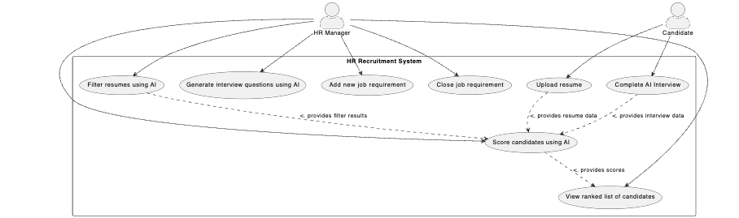
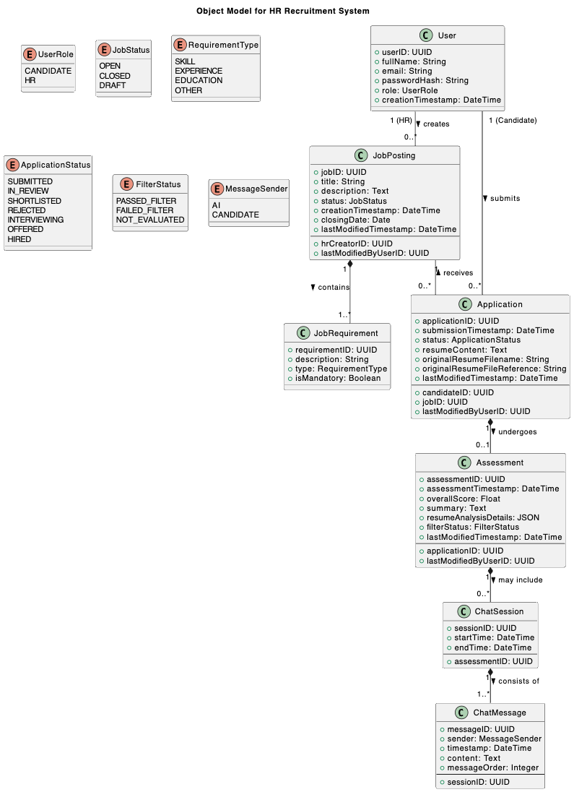

# README

## 1. Introduction

### 1.1 Who are the intended users?
* Our customers are HR personnel.
* Our users are candidates who apply for jobs.

### 1.2 What is the main functionality?

* Filter resumes to identify those qualified by job requirements or other criteria.
* Conduct simple automated conversations with candidates and score them.
* Show the scoreboard to HR personnel.

### 1.3 Describe some scenarios of how your app will function.

* We simulate an IT company's career website.
* Candidates upload their resumes to the website.
* The backend uses an LLM to filter resumes against the requirements of the target job.
* After filtering, the AI asks candidates for basic information about their resumes or related technologies (this may involve combining tech documents from a vector database). For example, it might ask questions about their understanding of the technologies listed in the job requirements or discuss projects/experiences detailed in their resume.
* The AI scores the candidates.
* HR personnel can see the list of scores on a console page.

### 1.4 How will you integrate GenAI meaningfully?

* AI filters resumes based on job requirements.
* AI scores candidates based on their resumes and chat history.

## 2. System Description

This system is designed with a layered architecture, consisting of the following layers:

*   **UI Layer**
    *   Tech: React
    *   Components: Candidate Portal, HR Dashboard
*   **Application Services Layer**
    *   Tech: Spring Boot
    *   Components: API Gateway, Job Management Service, Candidate Application Service, Candidate Assessment Service, LangChain GenAI Service
*   **Data Storage Layer**
    *   Tech: PostgreSQL + pgvector
    *   Details: PostgreSQL serves as the relational database for structured data, while pgvector provides vector database capabilities for RAG.
*   **External Services Layer**
    *   Details: OpenAI API for LLM capabilities (specific model TBD).

### 2.1 Server: Spring Boot REST API

The backend is implemented using **Spring Boot**, exposing RESTful APIs to support both candidate and HR operations. It handles business logic, including:

* Job posting and management (via `Job Management Service`).
* Candidate application processing (via `Candidate Application Service`).
* Resume filtering, interview generation, and scoring (via `Candidate Assessment Service`).
* Integration with external services, such as OpenAI, for GenAI tasks (via `LangChain GenAI Service`).

The `API Gateway` serves as the single entry point, routing requests from UI clients to the appropriate services.

### 2.2 Client: React Frontend

The system has two main user interfaces developed in **React**:

*   **Candidate Portal**: Allows candidates to upload resumes and complete AI-based interviews.
*   **HR Dashboard**: Enables HR users to post jobs, view filtered resumes, see generated interview questions, and review ranked candidate lists.

All frontend components communicate with the backend via REST APIs.

### 2.3 GenAI Service: Python, LangChain Microservice

A separate microservice is developed in **Python**, using **LangChain** to orchestrate LLM tasks. This `LangChain GenAI Service` is responsible for:

* Filtering resumes against job requirements and scoring them.
* Generating interview questions based on job requirements, candidate resumes, and documents in the vector database.
* Analyzing chat history and scoring candidates against job requirements.

It communicates with the main Spring Boot backend (Application Services Layer) and uses the **OpenAI API** for underlying LLM capabilities.

### 2.4 Database: PostgreSQL with pgvector

The system utilizes a **PostgreSQL** database extended with the **pgvector** extension to support semantic search and vector-based operations. It stores:

* User data (candidates, HR personnel)
* Job postings and requirements
* Candidate resumes and applications
* Assessment scores and chat histories
* Vector embeddings for technical documents (for RAG)

This design allows the system to store structured HR data alongside high-dimensional AI data used for generating questions, scoring, and analysis.

## 3. UML Diagrams

### 3.1 Top-Level Architecture Diagram



### 3.2 Use Case Diagram



### 3.3 Analysis Object Model



## 4. Backlog

1.  As an HR user, I want to add a new job requirement so that candidates can apply for it.
2.  As an HR user, I want to close a job requirement so that candidates can no longer apply for it.
3.  As a candidate, I want to upload my resume so that I can apply for a job.
4.  As an HR user, I want the AI to filter resumes so that I can find qualified candidates.
5.  As an HR user, I want the AI to generate questions to ask candidates so that I can better understand their qualifications.
6.  As a candidate, I want to answer the AI's questions about my resume or projects so that I can better present my strengths.
7.  As an HR user, I want the AI to score candidates based on their resumes and chat history so that I can find the best candidates.
8.  As an HR user, I want to view a ranked list of candidate scores so that I can quickly identify the best candidates.

## 5. Branch Name Template

```
week<digit>-<task>
```

## 6. Commit Template

```
<type>[optional scope]: <description>

[optional body]

[optional footer(s)]
```

For example:
```bash
git commit -m "feat: add a new feature" \
-m "add a new feature to the project" \
-m "closes: #1234"
```

**Commit Types:**

*   **feat**: A new feature
*   **fix**: A bug fix
*   **docs**: Documentation only changes
*   **ci**: Changes to CI configuration files and scripts
*   **test**: Adding missing tests or correcting existing tests
*   **refactor**: Refactoring code without changing business logic (e.g., changing variable names, structures, code style)
*   **perf**: Optimizing performance by improving code logic