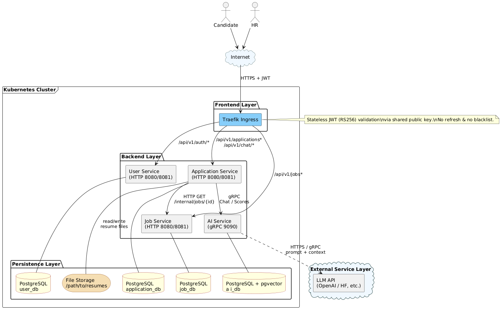

# README

| Branch      | Status                                                                                                                                                                                                                     |
|-------------|----------------------------------------------------------------------------------------------------------------------------------------------------------------------------------------------------------------------------|
| Main        | [](https://github.com/AET-DevOps25/team-1/actions/workflows/docker-publish.yml)                      |
| Backend-dev | [](https://github.com/AET-DevOps25/team-1/actions/workflows/docker-publish.yml) |

## Table of Contents

- [1. Introduction](#1-introduction)
- [2. System Description](#2-system-description)
- [3. UML Diagrams](#3-uml-diagrams)
- [4. Backlog](#4-backlog)
- [5. Branch Name Template](#5-branch-name-template)
- [6. Commit Template](#6-commit-template)
- [7. Getting Started](#7-getting-started)
- [8. API Reference (OpenAPI)](#8-api-reference-openapi)

## 1. Introduction

### 1.1 Who are the intended users?

* Our customers are HR personnel.
* Our users are candidates who apply for jobs.

### 1.2 What is the main functionality?

* Filter resumes to identify those qualified by job requirements or other criteria.
* Conduct simple automated conversations with candidates and score them.
* Show the scoreboard to HR personnel.

### 1.3 Describe some scenarios of how your app will function.

* We simulate an IT company's career website.
* Candidates upload their resumes to the website.
* The backend uses an LLM to filter resumes against the requirements of the target job.
* After filtering, the AI asks candidates for basic information about their resumes or related technologies (this may
  involve combining tech documents from a vector database). For example, it might ask questions about their
  understanding of the technologies listed in the job requirements or discuss projects/experiences detailed in their
  resume.
* The AI scores the candidates.
* HR personnel can see the list of scores on a console page.

### 1.4 How will you integrate GenAI meaningfully?

* AI filters resumes based on job requirements.
* AI scores candidates based on their resumes and chat history.

## 2. System Description

This system is designed with a layered architecture, consisting of the following layers:

* **UI Layer**
    * Tech: React
    * Components: Candidate Portal, HR Dashboard
* **Application Services Layer**
    * Tech: Spring Boot
    * Components: API Gateway, Job Management Service, Application Management Service, LangChain GenAI Service
* **Data Storage Layer**
    * Tech: PostgreSQL + pgvector
    * Details: PostgreSQL serves as the relational database for structured data, while pgvector provides vector database
      capabilities for RAG.
* **External Services Layer**
    * Details: OpenAI API for LLM capabilities (specific model TBD).

### 2.1 Server: Spring Boot REST API

The backend is implemented using **Spring Boot**, exposing RESTful APIs to support both candidate and HR operations. It
handles business logic, including:

* Job posting and management (via `Job Management Service`).
* Candidate application processing, resume filtering, interview generation, and scoring (via
  `Candidate Application Service`).
* Integration with external services, such as OpenAI, for GenAI tasks (via `LangChain GenAI Service`).

The `API Gateway` serves as the single entry point, routing requests from UI clients to the appropriate services.

### 2.2 Client: React Frontend

The system has two main user interfaces developed in **React**:

* **Candidate Portal**: Allows candidates to upload resumes and complete AI-based interviews.
* **HR Dashboard**: Enables HR users to post jobs, view filtered resumes, see generated interview questions, and review
  ranked candidate lists.

All frontend components communicate with the backend via REST APIs.

### 2.3 GenAI Service: Python, LangChain Microservice

A separate microservice is developed in **Python**, using **LangChain** to orchestrate LLM tasks. This
`LangChain GenAI Service` is responsible for:

* Filtering resumes against job requirements and scoring them.
* Generating interview questions based on job requirements, candidate resumes, and documents in the vector database.
* Analyzing chat history and scoring candidates against job requirements.

It communicates with the main Spring Boot backend (Application Services Layer) and uses the **OpenAI API** for
underlying LLM capabilities.

### 2.4 Database: PostgreSQL with pgvector

The system utilizes a **PostgreSQL** database extended with the **pgvector** extension to support semantic search and
vector-based operations. It stores:

* User data (candidates, HR personnel)
* Job postings and requirements
* Candidate resumes and applications
* Assessment scores and chat histories
* Vector embeddings for technical documents (for RAG)

This design allows the system to store structured HR data alongside high-dimensional AI data used for generating
questions, scoring, and analysis.

## 3. UML Diagrams

### 3.1 Top-Level Architecture Diagram



### 3.2 Use Case Diagram


### 3.3 Analysis Object Model


## 4. Backlog

1. As an HR user, I want to add a new job requirement so that candidates can apply for it.
2. As an HR user, I want to close a job requirement so that candidates can no longer apply for it.
3. As a candidate, I want to upload my resume so that I can apply for a job.
4. As an HR user, I want the AI to filter resumes so that I can find qualified candidates.
5. As an HR user, I want the AI to generate questions to ask candidates so that I can better understand their
   qualifications.
6. As a candidate, I want to answer the AI's questions about my resume or projects so that I can better present my
   strengths.
7. As an HR user, I want the AI to score candidates based on their resumes and chat history so that I can find the best
   candidates.
8. As an HR user, I want to view a ranked list of candidate scores so that I can quickly identify the best candidates.

## 5. Branch Name Template

```
week<digit>-<task>
```

## 6. Commit Template

```
<type>[optional scope]: <description>

[optional body]

[optional footer(s)]
```

For example:

```bash
git commit -m "feat: add a new feature" \
-m "add a new feature to the project" \
-m "closes: #1234"
```

**Commit Types:**

* **feat**: A new feature
* **fix**: A bug fix
* **docs**: Documentation only changes
* **ci**: Changes to CI configuration files and scripts
* **test**: Adding missing tests or correcting existing tests
* **refactor**: Refactoring code without changing business logic (e.g., changing variable names, structures, code style)
* **perf**: Optimizing performance by improving code logic

## 7. Getting Started

The following subsections outline the key environment files and automation scripts used during **local development**, **image build**, and **deployment**.

### 7.1 `.env` / `example.env`
Copy `example.env` to `.env` and customise environment variables such as database credentials, JWT keys, and `VITE_API_BASE_URL`. All services load `.env` automatically.

```bash
cp example.env .env
```

### 7.2 `docker-compose-db.yml`
Start **PostgreSQL + pgvector** only – perfect for frontend/backend development when other micro-services are not required.

```bash
docker compose -f docker-compose-db.yml up -d
```

### 7.3 `docker-compose.yml`
Launch **all backend + frontend** services for a complete local stack.

```bash
docker compose up --build -d
```

### 7.4 `docker-compose.prod.yml`
**Build** production-grade images only (does not run them). Mainly used in CI pipelines.

```bash
docker compose -f docker-compose.prod.yml build
```

### 7.5 `docker-compose.prod.deploy.yml`
**Run** the images built in step 7.4. Useful for staging or on-premise deployments.

```bash
docker compose -f docker-compose.prod.deploy.yml up -d
```

### 7.6 `terraform/terraform.sh`
Infrastructure-as-Code – provision cloud resources (VPC, RDS, EKS, etc.) with **Terraform**.

```bash
./terraform/terraform.sh apply
```

### 7.7 `ansible/ansible.sh`
Use **Ansible** to install dependencies, distribute configuration, and deploy services to the provisioned hosts.

```bash
./ansible/ansible.sh
```

### 7.8 `k8s-install.sh`
One-click installation of a lightweight **Kubernetes** cluster (k3s / micro-k8s) for testing. Contains commands for both development and production environments.

```bash
./k8s-install.sh
```

> All scripts are executable. If you encounter permission issues, run `chmod +x <script>`.

## 8. API Reference (OpenAPI)

An offline copy of the API specification lives in [`api-openapi-firefox-online.md`](./api-openapi-firefox-online.md).
The file was generated automatically by **Apifox** after the project was completed and can be fed to an LLM to help it
understand the entire API surface.

* Online interactive documentation / playground: <https://ifoh7semfe.apifox.cn/>
* The spec follows **OpenAPI 3.0** and can be imported into Postman, Stoplight, Swagger-UI, etc.